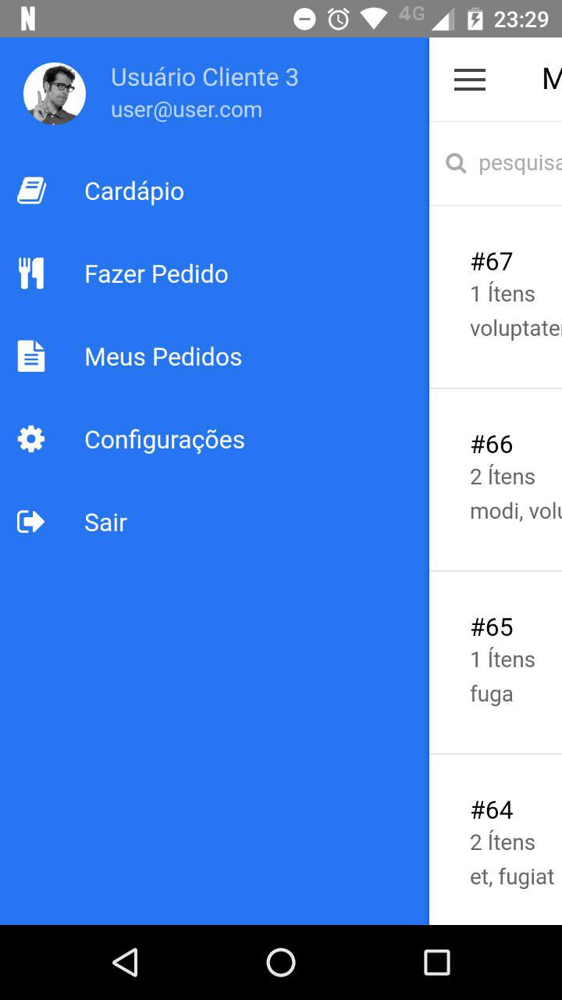
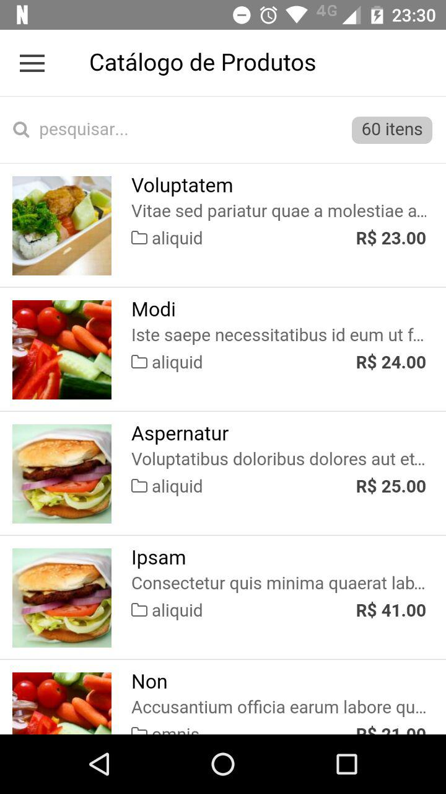
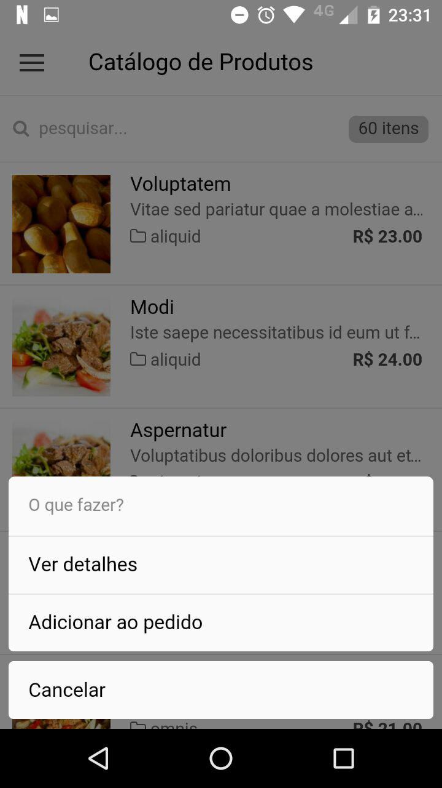
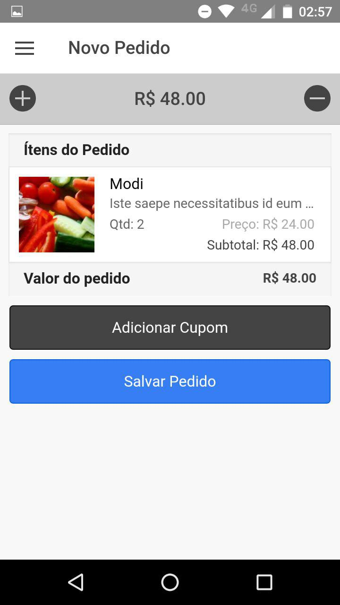
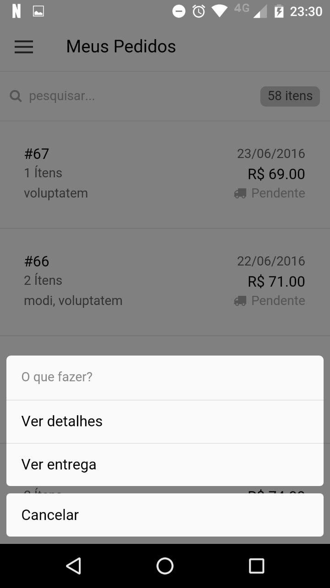
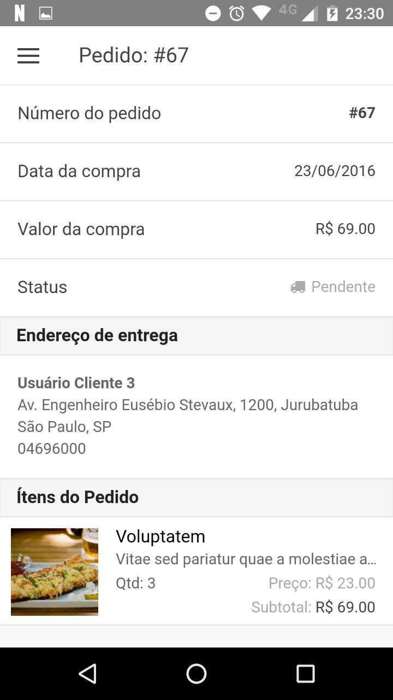

## Laravel PHP Framework

## laravel-codedelivery
Código desenvolvido durante o Curso Laravel 5.1 + Ionic + Cordova - Code Education [Laravel 5.1 + ionic + cordova](http://sites.code.education/laravel-ionic-cordova/)

## Screenshots

